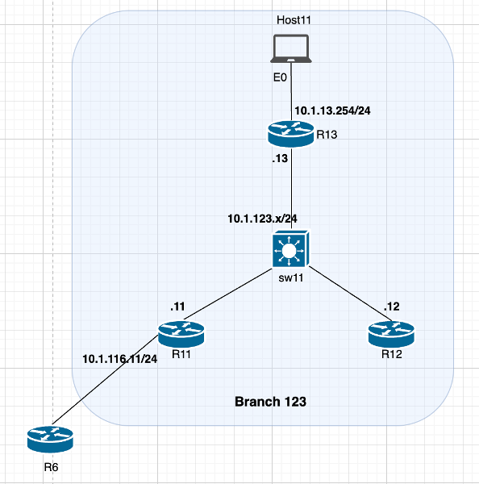
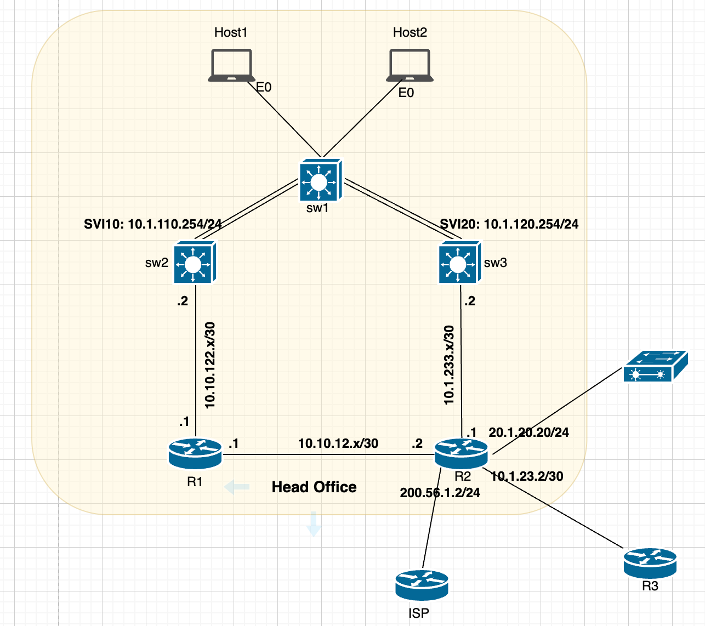

# Section 1: Basic Routing & Switching Configuration

## Overview

This section outlines the configuration tasks for setting up and integrating **routing**, and **switching** components across **Branch 123** and **Head Office** environments. The tasks focus on configuring OSPF, HSRP, BGP, EIGRP, VLANs, and port-channels to ensure seamless connectivity and routing. Follow the instructions below to configure the network as per the provided requirements.

## Task List

### Branch 123 Configuration

1. **DHCP and OSPF Setup**  
                - Configure **DHCP server (R12)** to make sure **Host11** obtains the IP address.  
                - Ensure **Host11** has reachability to its default gateway.  
                - Implement **OSPF process 123** and **OSPF Area 0** on routers **R11**, **R12**, and **R13** to facilitate routing.  
                - Prevent **DR/BDR election** between **R11**, **R12**, and **R13** to optimize OSPF operation.

2. **HSRP Configuration**  
                - Configure **HSRP** on **R11** and **R12** and designate **R11** as the **primary router**. 
                - Set the **HSRP priority** to **120** for the primary router.  
                - Use **MD5 authentication** with the shared key **"cisco"**.  
                - Configure the **virtual IP address** as **10.1.123.123** with **HSRP group number 123**.

3. **BGP Peering and Redistribution**  
                - Establish **BGP peering** between **R11** and **R6 (PE router)**.  
                - Perform **redistribution** on **R11** to advertise the **Host11 subnet** to **R6**.  
                - Use **BGP AS123** on **R11** for peering.

### Head Office Configuration

4. **EIGRP Configuration**  
                - Configure **EIGRP AS10** on **R1**, **R2**, **SW2**, and **SW3** based on their network connections.

5. **VLAN Configuration on SW1**  
        - Restrict **Gi1/0** interface on **SW1** to allow only **VLAN 10**.  
        - Restrict **Gi1/1** interface on **SW1** to allow only **VLAN 20**.

6. **Port-Channel Configuration**  
        - Create a **port-channel** between **SW1** and **SW2** to allow only **VLAN 10**. Use port-channel number **12**.
        - Create a **port-channel** between **SW1** and **SW3** to allow only **VLAN 20**. Use port-channel number **13**.

7. **Host Connectivity**  
        - Ensure **Host1** and **Host2** can ping their respective **default gateways** configured on **SW1** and **SW2**.

8. **BGP Peering and Redistribution**  
        - Establish **BGP peering** on **R2** with **R3** and the **ISP**.  
        - Configure **R2** to redistribute all **EIGRP-learned routes** and **SDWAN prefixes** into **BGP**, and vice versa.  
        - Use **BGP AS12** on **R2** for peering.

## Next Steps

- Refer to the network topologies provided in the images for clarity on device connections.  
- Complete each task sequentially to ensure proper configuration and connectivity.  
- Verify configurations using appropriate show commands and test connectivity (e.g., ping tests).