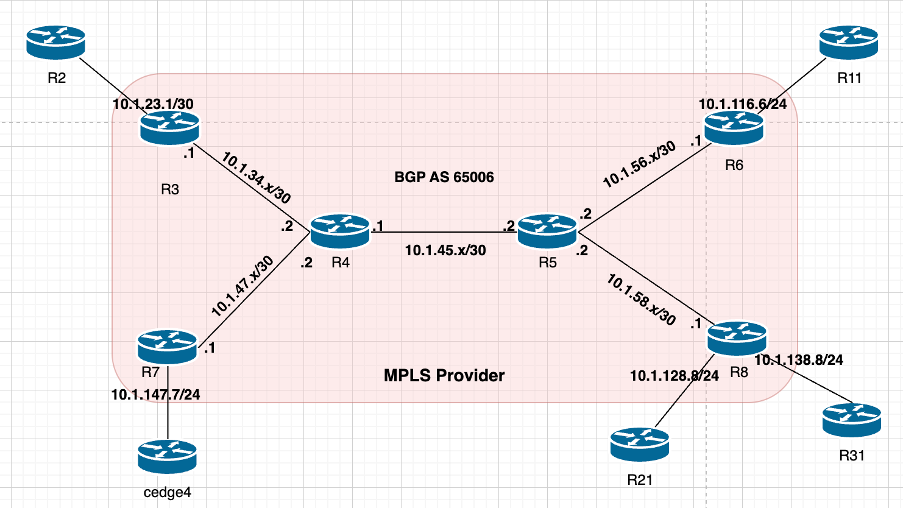

# Section 2: MPLS Provider Configuration

## Overview

This section details the configuration tasks for establishing an **MPLS provider network** to enable seamless connectivity between **Head Office**, **Branch 123**, **Branch 21**, **Branch 31**, and **SDWAN BR2**. The tasks focus on setting up the MPLS core using OSPF, configuring LDP, establishing BGP VPNv4 peering, and ensuring reachability across all sites. The provided topology diagram illustrates the connections and aids in understanding the configuration requirements.

### MPLS Provider Network Topology

**Diagram Description**: The MPLS provider topology depicts the core network infrastructure, including **PE routers (R3, R6, R7, R8)** and their connections to **CE devices (R2, R11, R21, R31)** across **Head Office**, **Branch 123**, **Branch 21**, **Branch 31**, and **SDWAN BR2**. Focus on the MPLS core, OSPF configuration, LDP setup, and BGP peering to ensure end-to-end connectivity.

## Task List

### MPLS Provider Configuration

1. **MPLS Core Activation**  
        - Enable the **MPLS provider network** to provide reachability between **Head Office**, **Branch 123**, **Branch 21**, **Branch 31**, and **SDWAN BR2**.

2. **OSPF Configuration**  
        - Configure **OSPF process ID 1** to establish the MPLS core.  
        - Ensure **no DR/BDR elections** occur on any OSPF-enabled interfaces to optimize the core network.

3. **LDP Configuration**  
        - Set the **LDP router-ID** to **Loopback0** on all MPLS routers for consistent label distribution.

4. **BGP AS Configuration**  
        - Configure **BGP AS 65006** on all **MPLS PE routers (R3, R6, R7, R8)**.

5. **BGP VPNv4 Peering**  
        - Establish **BGP VPNv4 peering** between **PE routers (R3, R6, R7, R8)** using **Loopback0** to support MPLS VPN services.

6. **PE-CE BGP Peering**  
        - Configure **BGP peering** between **PE routers (R3, R6, R8)** and their respective **CE routers (R2, R11, R21, R31)** as per the network topology.

7. **Subnet Advertisement**  
        - Advertise **PE-CE subnets** to ensure full reachability between **Head Office**, **Branch 123**, **Branch 21**, **Branch 31**, and **SDWAN BR2**.

## Quick Check

- After completing the configurations in **Section 1** and **Section 2**, verify connectivity by ensuring **ping** works between the hosts in **Head Office** and **Branch 123**.  
- Use appropriate show commands (e.g., `show ip route`, `show mpls ldp bindings`, `show bgp vpnv4 all`) to validate the MPLS core, BGP peering, and subnet reachability.

## Next Steps

- Refer to the MPLS provider topology diagram for clarity on router connections and configurations.  
- Complete each task sequentially to ensure proper setup and connectivity.  
- Test end-to-end connectivity using ping and traceroute to confirm successful configuration.