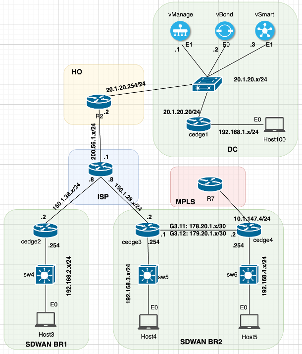

# Section 4: SDWAN Configuration

## Overview

This section details the configuration tasks for setting up and managing an **SDWAN** environment using Cisco's vManage, vSmart, and cEdge devices. The tasks focus on configuring the vSmart controller, applying device and feature templates, creating policies for traffic management, and establishing TLOC extensions. The provided topology diagram illustrates the SDWAN architecture and connections to guide the configuration process.

### SDWAN Network Topology

**Diagram Description**: The SDWAN topology depicts the relationships between the **vSmart controller**, **cEdge devices (cEdge1, cEdge3, cEdge4)**, and hosts (**Host3** and **Host4**) across **SDWAN BR1** and **SDWAN BR2**. It highlights the hub-and-spoke policy setup, TLOC extensions, and control connections. Focus on the vManage-managed configurations and policy applications to ensure proper connectivity.

## Task List

### SDWAN Controller and Device Configuration

1. **vSmart Controller Configuration**  
        - Configure the **vSmart controller** to be managed by **vManage** in template mode to enable policy enforcement.  
        - Use the template name **"vSmart"** for the vSmart configuration.

2. **cEdge1 Device Template**  
        - Bring up **cEdge1** using a **device template** composed of **feature templates**.  
        - Ensure all device and feature template names start with **"CEDGE1"**.  
        - Verify that **cEdge1** is displayed as managed by the template in vManage.

3. **User Account Configuration**  
        - Create a new user account on **cEdge1** named **"CCIE_User"** with **privilege level 15** and a secret password **"ccie123"**.  
        - Apply this configuration using a **CLI add-on template**.

### Policy Configuration

4. **Hub-and-Spoke Policy**  
        - Create a **Hub-and-Spoke policy** named **"Hub_N_Spoke_Policy"** to ensure **Host3** can ping **Host4** via the hub (**cEdge1**).

5. **SSH Traffic Policy**  
        - Configure a policy named **"spokes_ssh_dscp_policy"** to mark **SSH traffic** with a **DSCP value of 10** for host prefixes connected to **spoke devices** only.

### TLOC Extension Configuration

6. **TLOC Extension between cEdge3 and cEdge4**  
        - Configure **TLOC extension** between **cEdge3** and **cEdge4** using the existing CLI-based templates:  
            - **cedge3_Device_Template** applied to **cEdge3**.  
            - **cEdge4_Device_Template** applied to **cEdge4**.  
        - Verify that both **cEdge3** and **cEdge4** establish **control connections** and **BFD sessions** with both **biz-internet** and **MPLS** colors.

## Quick Check

After completing the configurations in **Section 4**, verify the following:

- **vSmart** and **cEdge1** are managed by **vManage** in template mode.  
- **Host3** in **SDWAN BR1** can ping **Host4** in **SDWAN BR2** via the hub (**cEdge1**).  
- **cEdge3** and **cEdge4** show active **control connections** and **BFD sessions** for both **biz-internet** and **MPLS** colors.  

Use appropriate vManage tools and CLI commands (e.g., `show sdwan control connections`, `show sdwan bfd sessions`, `ping`) to validate the configurations.

## Next Steps

- Refer to the SDWAN topology diagram for clarity on device connections and policy applications.  
- Complete each task sequentially to ensure proper setup and connectivity.  
- Validate configurations using vManage dashboards and CLI commands to confirm policy enforcement and reachability.